+++
title = 'Running XCSoar on the Kobo Clara Colour'
date = 2026-07-05T18:17:32+12:00
draft = true
+++

For years e-readers have had a mini cult following among glider pilots because e-ink handles direct sunlight vastly better than any traditional smartphone or tablet screen. However, navigating airspace and interpreting terrain on a monochrome display, while it can work, has it limits. When the [Kobo Clara Colour](https://gl.kobobooks.com/products/kobo-clara-colour) came out, it looked like the ultimate hardware platform for a sunlight-readable flight computer running [XCSoar](https://xcsoar.org/). It had the readability of e-ink but with the color contrast needed to clearly separate airspaces and flight paths.

Up to now though, no one's been able to get XCSoar running on the Kobo Clara Colour. The first hurdle is that the usual method of installing XCSoar on an sdcard and replacing the stock sdcard doesn't work, because the Clara Colour doesn't have a removable sd card. The flash is soldered on to the board. And worse, it uses UEFI (secure boot) so even if you could write to the flash directly, it would just brick the device. People have tried.

Another issue is that the Clara Colour completely lacks an internal GPS module. While you can always hook up an external GPS via Bluetooth or a dangling wired puck, it adds clutter to a compact glider cockpit and introduces another battery you have to worry about charging.

In this post I'll describe how I managed to successfully get XCSoar running on the Kobo Clara Colour. This is the first time anyone's done this. My work builds upon the excellent work of the people behind [NickelMenu](https://pgaskin.net/NickelMenu/), who's amazing work allows third-party devs to compile custom apps for the Kobo.

## Initial Investigation

Obviously some hardware and software mods would be necessary, but before cutting into the case, I needed to confirm XCSoar would actually run on the Kobo Clara Colour. Using NickelMenu, I set up a launch entry. After a couple days of work and some changes to the repo to get it to compile for the new MediaTek chipset used in the Clara Colour, I was awared with the first boot: a standard splash screen!

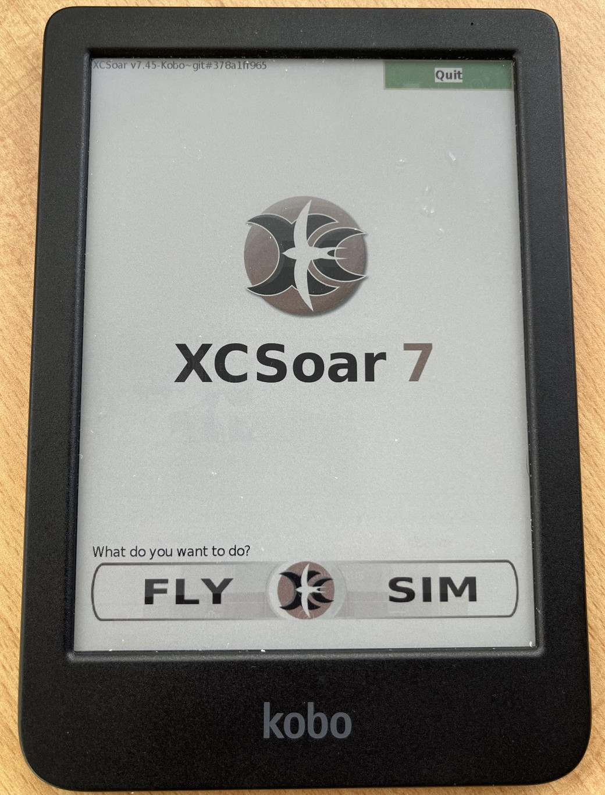

Getting into the main UI, it was obvious some work was needed. The rendering was a mess and the button text didn't work. But the core application was running. This was enough to convince me the project was possible on the software side, so now I wanted to see if it was possible on the hardware side.

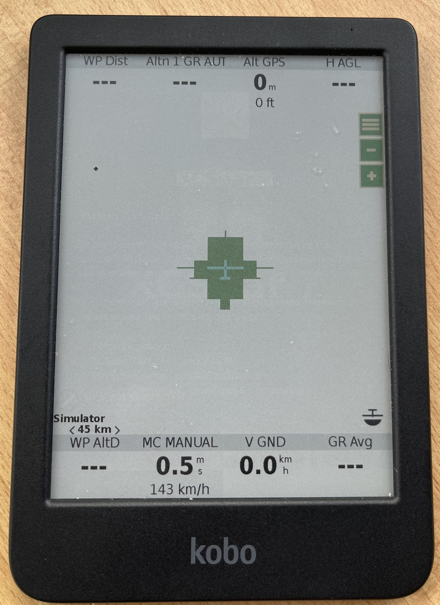

Next step is the GPS module.
The Kobo Clara Colour doesn't have a gps/gnss module, so it was either going to need an external one (connected via e.g. bluetooth) or an internal one. My preferance was internal as it would be a lot cleaner and less hassle in a glider. I opened the kobo clara colour up to see if I could add one. Usually electronics like this doesn't have much extra space inside, but I was happy to see that for this device there was a good spot - a void space just above the battery, that was occupied with some plastic reinforcing ribs on the back cover, that could be removed. Two constraints immediately stood out, though: the module would have to be thin (under 3 mm), and compatible with whatever communication ports the kobo exposes.

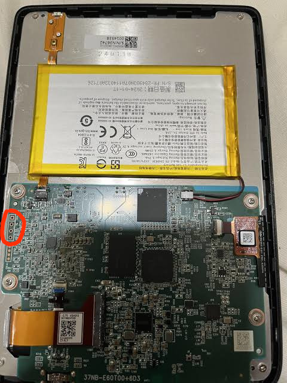

The only port that seems to be available is the "J5" port which is a UART (circled in the picture). I couldn't find a lot of info about this UART on the internet other than a single post which said they managed to read some boot messages off of it. One important note, which I confirmed via probing, is  that it is a 1.8 V UART, so a gnss module would have to be either 1.8 V or otherwise compatible with this UART voltage. Below you can see my initial soldering of wires to this port, to try and probe its speed/voltage.

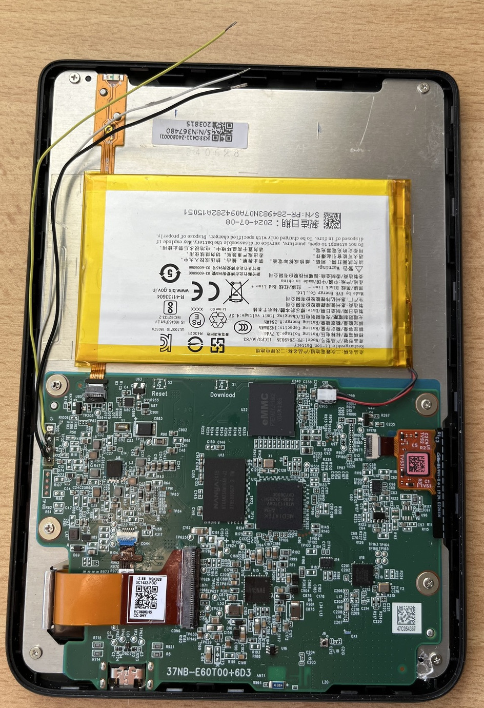

I considered 3 possible mounting options for the gnss: Either the module would have an integrated antenna, or the module would be small enough that both the module and an active antenna could be placed inside the 60x20x3 mm cavity, or the module would have an antenna port and could be wired up to an ultra-thin FPC antenna somewhere else inside the case.

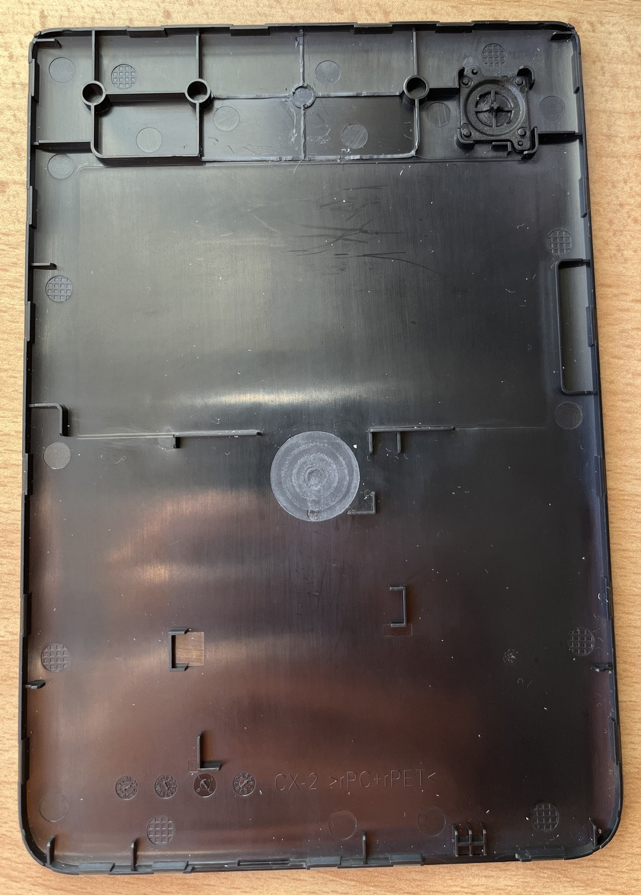

After much searching around available options, I decided to go with the 3rd design. Most small GPS antennas you find, the so-called "ceramic patch" antennas, are actually active antennas (they require power and preamplify the signal; the power is provided via the same coax cable). An active antenna this thick wouldn't fit anywhere in the case. These active antennas are also usually multi-band for higher positioning precision. However, multi-band doesn't provide a huge amount of benefit for an aviation instrument because cm-level precision isn't required; we just want a good stable fix. Because of physics, a multi-band antenna will always have worse performance at a single band than a dedicated antenna for that band. So for aviation it makes sense to trade off multi-band performance for good performance at one band. The [AC31002 antenna](https://www.antennacompany.com/product/ac31002-gnss-gps-galileo-glonass-beidou-l1-e1-g1-b1-embedded-adhesive-mount-cabled-ufl-plug-fpc-antenna/) is an ultra-thin, passive FPC antenna that provides 4.5 dBi gain for the 1560-1602 MHz band, covering GPS L1, GLONASS I/II L1, Galileo E1, and Beidou-B1-2. This is great performance for a passive omnidirectional antenna, basically as good as an active antenna, and also it's designed to be flexible and has adhesive backing for mounting to plastic cases. I decided it was a perfect fit.

For the GNSS module itself. The 3.0 mm height requirement is actually fairly restrictive, because most modules+carriers are around 2.4mm+1.2mm = 3.6mm which wouldn't fit. I narrowed my search to integrated modules that have a gnss chip directly on top of a pcb that also provide a UART and antenna port, and could be directly wired to the UART. Unfortunately, my search didn't turn up anything promising, except the REYAX RYS8833_Lite, which seemed very rare and hard to find (for my location), and also I couldn't verify it was thin enough anyway. It also only has an update rate of 1 Hz, whereas we would really like 5 Hz or more to be ideal.

I decided the easiest way I was going to be able to have a module that was good, thin, and met my other requirements, was to just make one myself. I decided to use a ublox module, but to keep it thin, I wouldn't mount it on the pcb. Instead, I would make a cutout, and mount it inside that. For the module, I selected the [MAX-M10S](https://www.u-blox.com/en/product/max-m10-series), which has very low power consumption and supports a 10 Hz update rate. The MAX-M10S' pcb is around 0.7mm thick, so by sinking this thickness, the total thickness would come to around 2.9 mm, which fits nicely. Another option would have been a flex pcb, but I decided the downsides of flex weren't worth it, for this application.

An important consideration is power use. The MAX-M10S uses only around ~10 mA when actively tracking, which isn't all that much. The kobo has a 1450 mAh battery. But still, it's nice for it to be turned off when not in use. The kobo usually operates in one of 3 modes: on (e.g. reading a book), "idle" (display powered off but processor still running), and turned off. I found a stable 1.8V line by hunting around on the kobo's main board, and set up the V_BCKP of the gnss module, and the EN of the LDO regulator, to be connected to this line. The line is on when it's on or idle. So when the kobo is idle, the gnss module is powered on, and we can instantly bring it back up. If the kobo is shut down, the gnss is turned off, and the power consumption effectively goes to 0. The tradeoff is that when we cold boot the kobo, we have to wait ~30s for it to obtain a fix. The final trick for power management is that when we go to idle (screen off) mode, to send software commands to the MAX-M10S to turn off tracking but keep tracking data in memory, so that it only consumes a tiny amount of power but comes back up instantly.

I designed the PCB, ordered the parts, and sent out the PCB to be made. The GNSS module came out to $12. The antenna was $3. The 4-layer, 1.2 mm thickness, 35x20 mm pcb came out to $7. So all together, $22, excluding shipping.

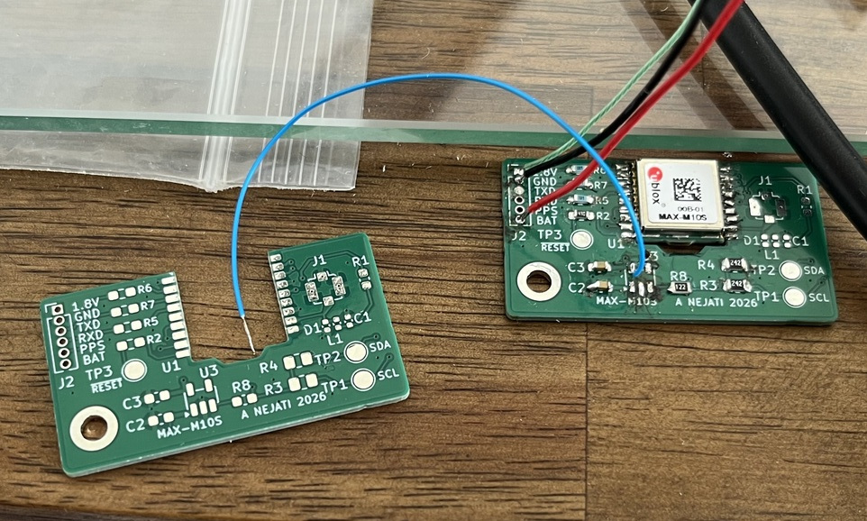

Assembly: I noticed the U.FL connector would be too thick to fit cleanly inside the case, so I cut off the end of the antenna coax, stripped it, and soldered it directly to the board. Soldered coax connections are generally to be avoided because they are less repeatable, but in this case I didn't have much of a choice other than changing the design and picking a different antenna.

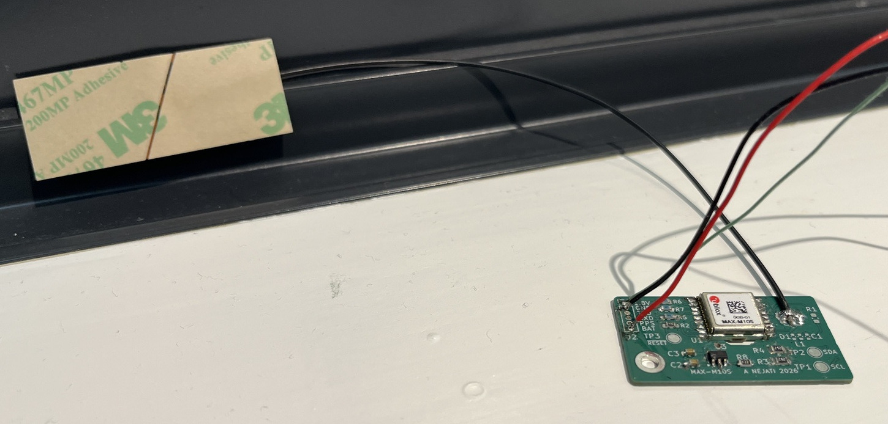

## Power Difficulties

As I explained earlier I didn't want the gnss board to be powered on all the time even when the kobo is off. One option was to find some kind of 3.3V or 5V bus supply on the kobo, but without the schematic, it's impossible to really tell how much current a given pin or line could handle. I figured the 'safest' way would be to just power the board from the li-po battery directly, but with the board's ENABLE being driven by a pin on the kobo. This way, to turn the gnss module on, we only really have to find a pin on the kobo that can put out any logic level (1.8V, 3.3V, or 5V) while on.

I assumed the ublox module's VCCIO pin wouldn't draw much current, so I decided to not have a 1.8V regulator on the gnss board, and instead just tie it to the same 1.8V logic ENABLE pin. This turned out to be an issue. The first 1.8V line I found on the kobo wasn't suitable, and the ublox module's IO wasn't able to power up from it.

So I needed to find a good 1.8V supply on the board. This turned out to take a lot more time than I thought. Part of the issue is the board is coated with water-repellent material, so even probing the board was hard and required carefully scraping off bits of the coating with a razor. I probably probed a hundred contact points before finding a good 1.8V on one of the pins of the (unpopulated) R50 pad (circled on the pic below). Connecting it up, it worked, and the ublox module powered on correctly. And also it was powering off when the kobo was off. Success -- it made me feel less bad about not just having a 1.8V regulator on the board.

However, right after this, a second, different problem hit me. With the gnss board turned on from kobo startup, it was preventing the kobo from booting, probably due to some weird UART interaction causing the kobo to abort boot early on. I could only get the kobo to boot by keeping the gnss board off during kobo boot (turning it on after boot was fine). Doing some experimenting, the gnss board needed to be held off for a full 4-5 seconds or so to ensure the kobo would boot fine every time.

I thought of a few workarounds for this. One was to configure the ublox module to not interact via UART until explicitly commanded to do so. But this would probably lead to other problems. I'd need to provide backup power to the ublox module otherwise it would forget this setting between boots. This meant redesigning and reassembling the board, adding another regulator, etc. And if it ever lost backup power, I'd need to take everything apart again and reprogram the module. I kept this as an option but decided to try another way.

One complication is that the ublox datasheet specifically calls out that if RX/TX is powered, then VCC_IO must be powered, and if VCC_IO is powered, then VCC must be powered as well. So turning off the module while the kobo is powered and the RX/TX pins are connected is potentially dangerous and could damage the module.

Another workaround was some kind of software fix on the kobo side. But diving into the boot config, I realized it would be hard/impossible to modify boot settings on the MT8113+secure boot setup without risking bricking the device.

I figured the most straightforward way would be to power on the gnss module from boot *but* hold the RESET pin *low* for a few seconds. This has an electrical advantage too: when the ublox module is in RESET, the RX/TX pins are high-Z, so they can be safely powered on without damaging the module.

The RESET pin has an internal pullup (10k) so in principle you could delay it simply by wiring a capacitor between the pin and GND. But to delay for >5 seconds I'd need a 470uF capacitor and I didn't have a small enough one handy. I deadbug-wired together a simple time delay circuit using surface mount npn transistor, a 330k resistor, a 1M resistor, and a MLCC 57uF capacitor. It provided a delay of around 10s which was more than enough. With everything connected, the kobo booted normally, the ublox module came up, and I'm staying fully within electrical specs. Success.

In the pic below, I've circled the R50 pad (for 1.8V, on the left side of the board) and the capacitor near the battery connector which I tapped for battery power. Ignore the silly looking cellotape.

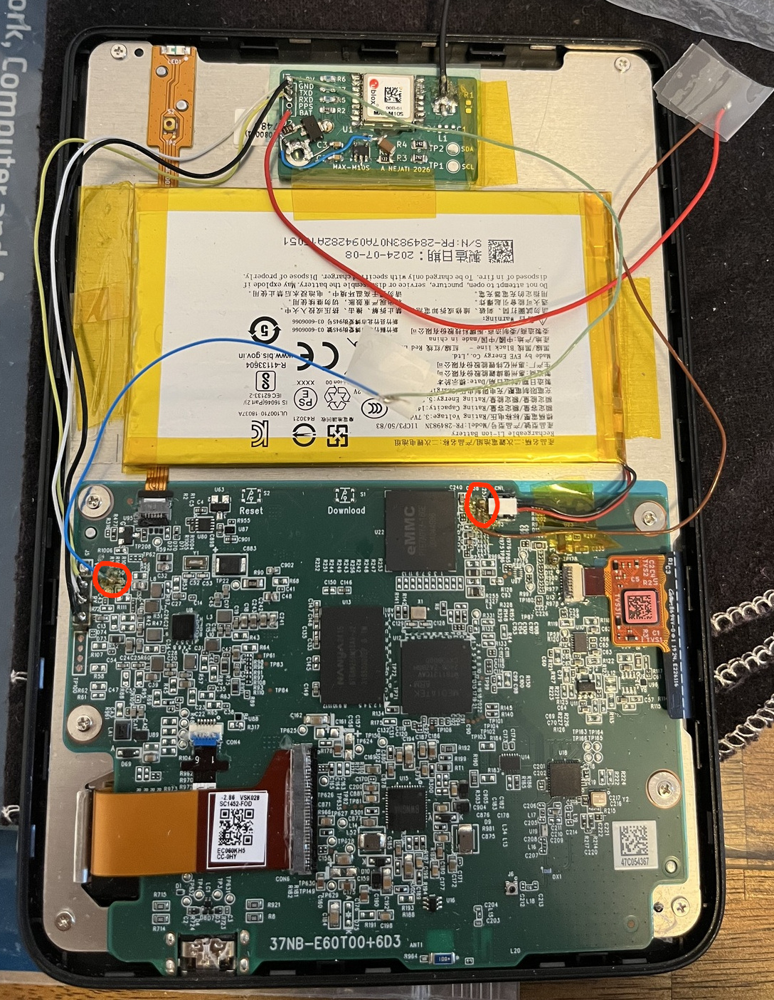

With the hardware buttoned up and the boot issues bypassed, it was time to verify the software side. I patched the rendering bugs and booted XCSoar back up. Without any map data loaded yet, I just wanted to verify the UART communication and GPS behavior.

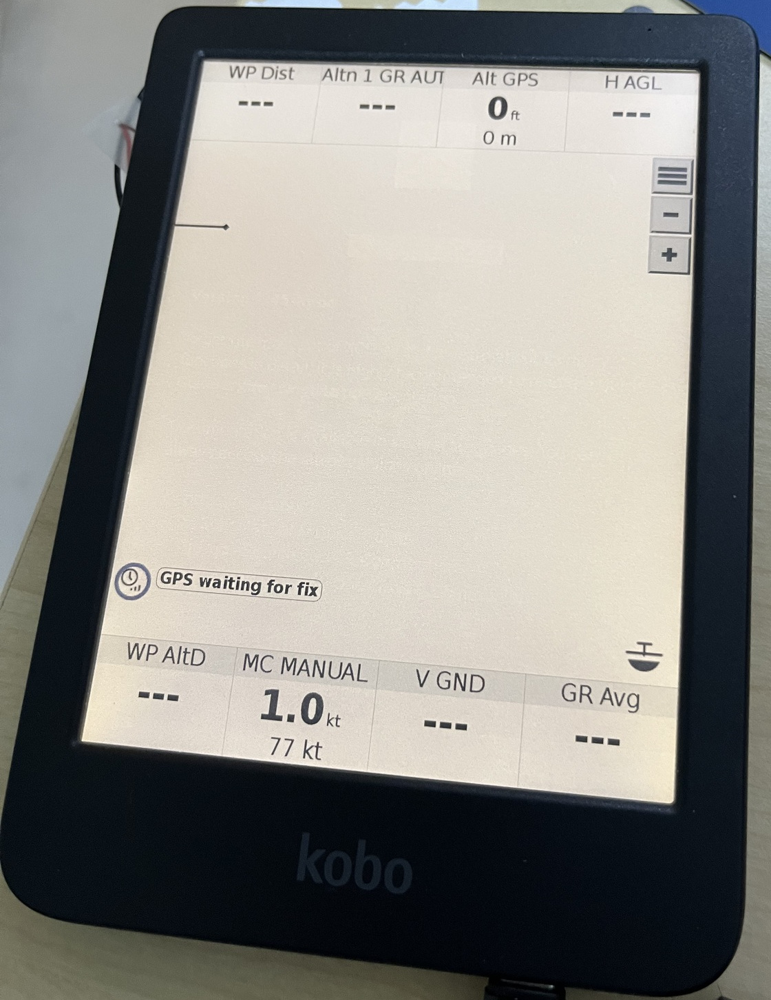

After a short wait, the MAX-M10S grabbed a lock.

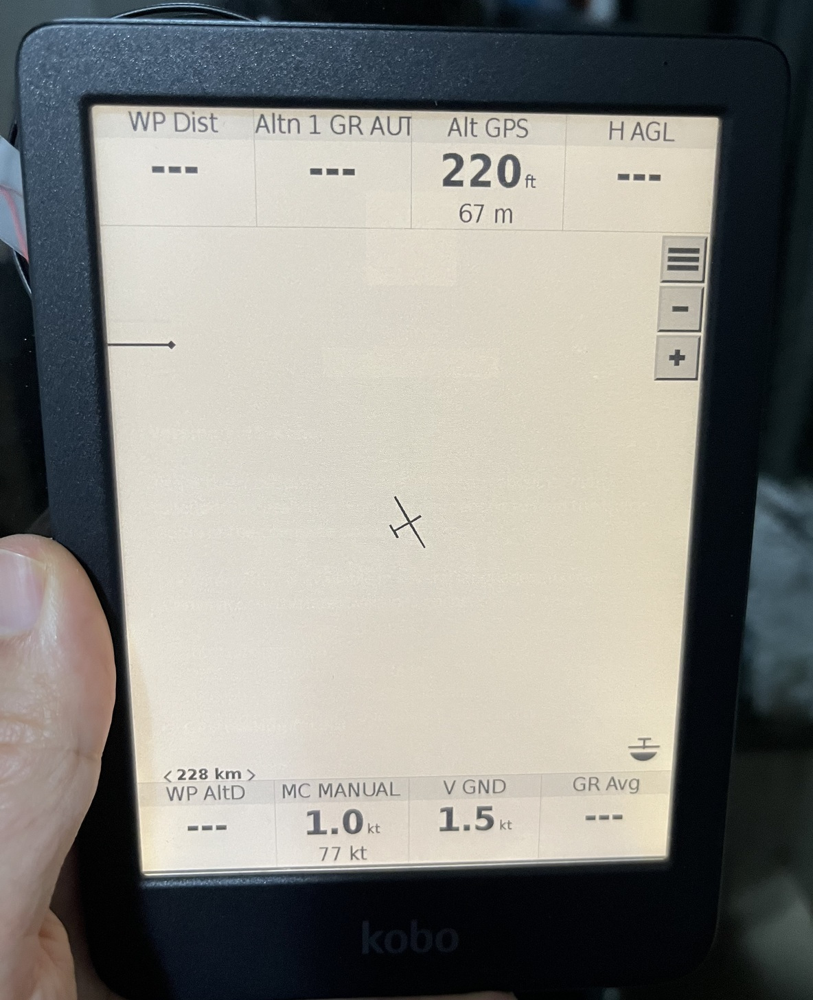

Next up was getting the actual map and airspace data loaded to see how the color e-ink handles it. Rebooting with the maps in place gives the updated splash screen.

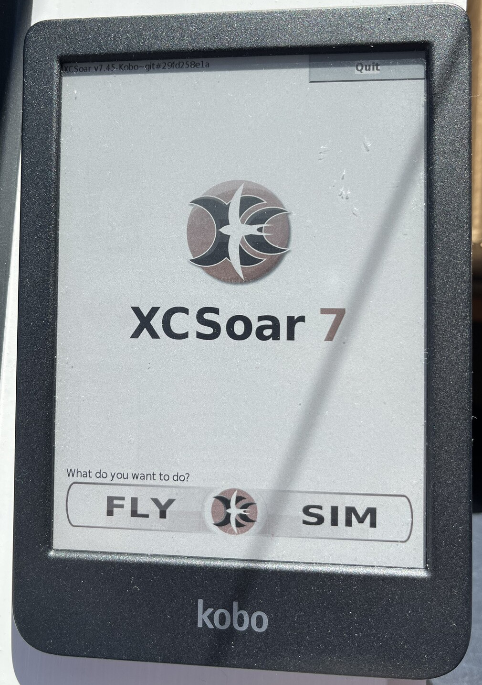

The map view is where the Clara Colour really proves its worth. The colors make differentiating airspace, terrain, and flight path much easier compared to standard black-and-white e-ink displays.

Checking the status page confirmed the final hardware integration was solid, showing a 3D fix tracking multiple satellites inside.

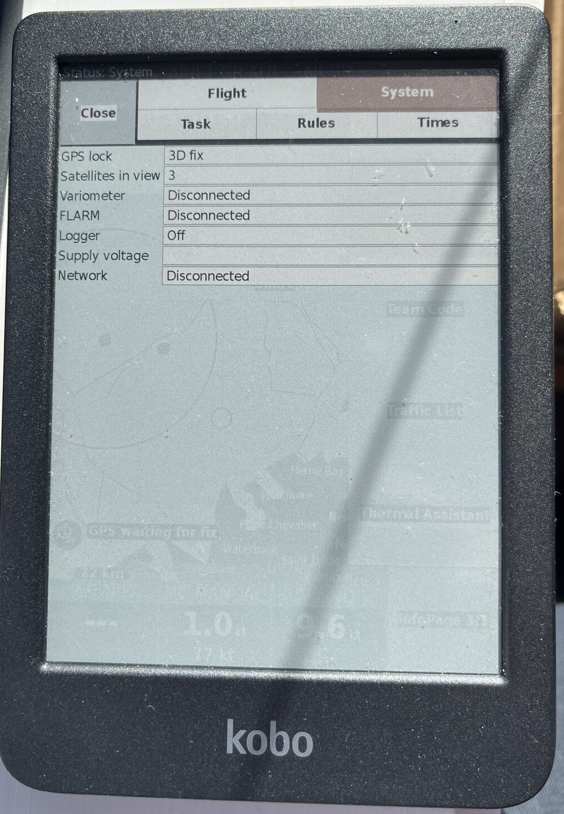

Finally, I ran a flight simulation to confirm the UI rendering was completely sorted during active screen updates. The text is legible, the rendering is clean, and the device is ready.

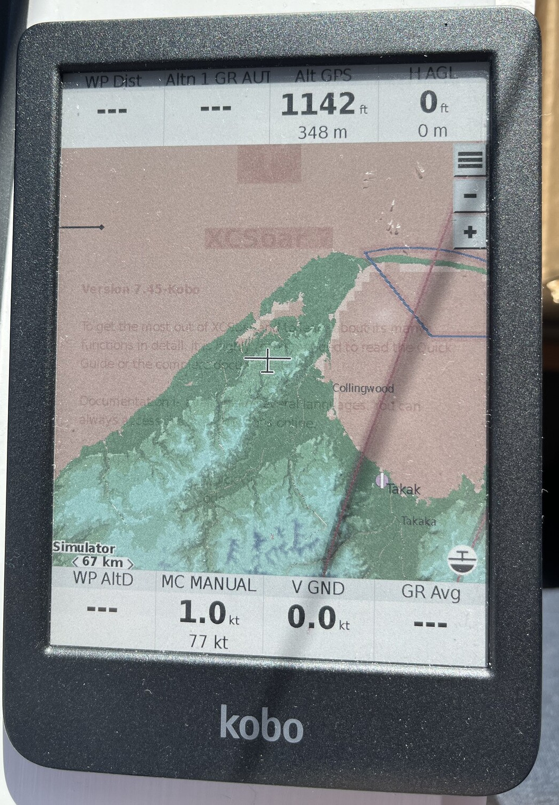